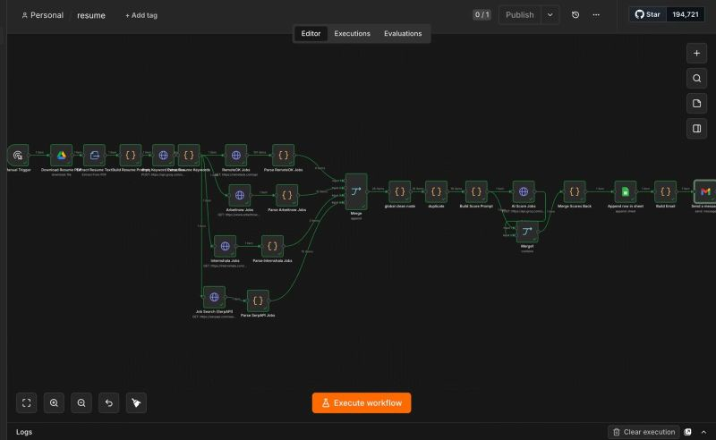
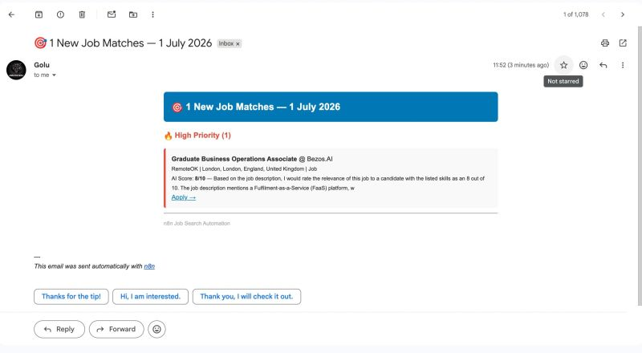

# AI Job Search Automation using n8n

This project automates the job search process using **n8n**.  
It takes a resume PDF, extracts relevant skills and job keywords using **Groq LLM**, searches jobs from multiple platforms, scores them using AI, stores them in Google Sheets, and sends an email summary.

---

## Features

- Download resume PDF from Google Drive
- Extract resume text from PDF
- Generate target roles, skills, and job keywords using Groq
- Search jobs from:
  - RemoteOK
  - Arbeitnow
  - Internshala
  - Google Jobs (via SerpAPI)
- Normalize and merge job data
- Remove duplicate job listings
- Score job relevance using AI
- Save results to Google Sheets
- Send job match email via Gmail

---

## Workflow Steps

1. Manual Trigger
2. Download Resume PDF from Google Drive
3. Extract Resume Text
4. Build Resume Prompt
5. Groq Keyword Extraction
6. Parse Resume Keywords
7. Fetch jobs from multiple sources
8. Parse and clean jobs
9. Merge and remove duplicates
10. Score jobs using AI
11. Append jobs to Google Sheets
12. Build and send email summary

---

## Tech Stack

- n8n
- Groq API
- SerpAPI
- Google Drive
- Google Sheets
- Gmail
- RemoteOK API
- Arbeitnow API
- Internshala scraping

---

## Setup

1. Import `workflow.json` into n8n
2. Add your credentials in n8n:
   - Google Drive OAuth2
   - Google Sheets OAuth2
   - Gmail OAuth2
   - Groq API
3. Replace placeholder values:
   - `YOUR_GROQ_API_KEY_HERE`
   - `YOUR_SERPAPI_KEY_HERE`
   - `YOUR_GOOGLE_SHEET_ID_HERE`
   - `YOUR_EMAIL_HERE`
4. Run the workflow manually or connect it to a schedule

---

## 📸 Screenshots

### n8n Workflow

### Job Match Email

---

## Notes

- Do **not** upload real API keys to GitHub
- Keep secrets in environment variables or n8n credentials
- This workflow is useful for internship and entry-level job search automation
